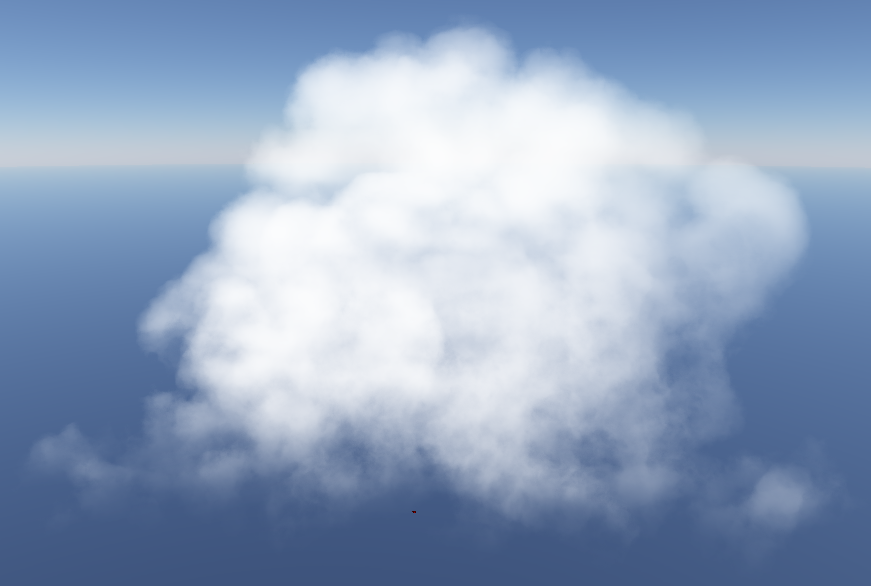
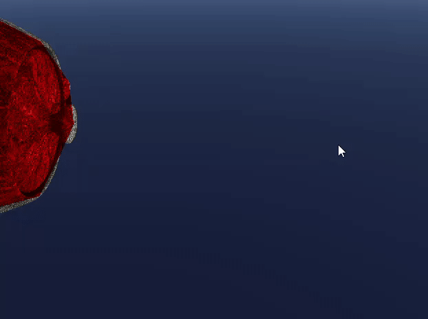
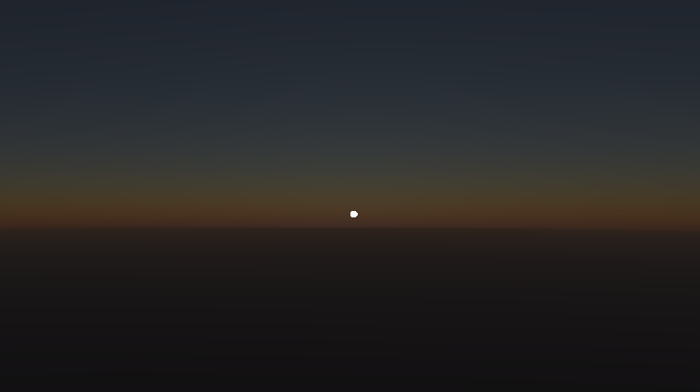
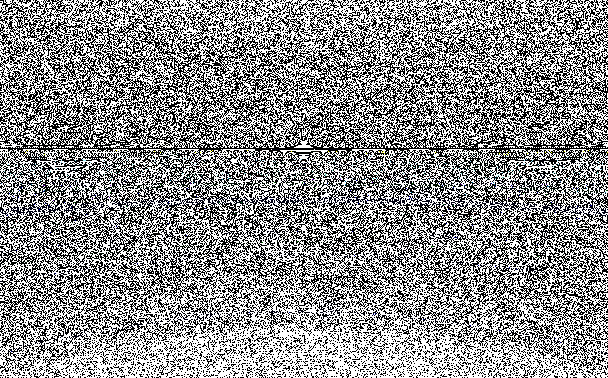

# Cumulus
A DirectX 12 project for real-time enabled cloud simulation and interactivity.

Made by [Ruben Young](https://www.rubenaryo.com/) [Jacky Park](https://jackypark.com/) [Eli Asimow](https://easimow.com/) and [Avi Serebrenik](https://aviserebrenik.wixsite.com/cvsite), Fall 2025

[Project Document](https://docs.google.com/document/d/1CNzmIo68LndPGS8ccK94FSIFHYH-5GL8HYOYqQdy90E/edit?usp=sharing)
[Milestone 1 Presentation](https://docs.google.com/presentation/d/1gGSEbZ7L8bbZHOn7OLQdZIwVBOCtymcEXTAHn48AE7w/edit?usp=sharing)

  
   
  <em>Camera flying in to a cloud</em>

## Overview
At its core, Cumulus is a realtime DirectX 12 cloud renderer with collisions, GPU generated clouds, and a clear environment.  

We utilize the cloud rendering framework from the Horizon game series, as outlined in the [Nubis 3](https://www.guerrilla-games.com/read/nubis-cubed) presentation from Advancements in Real-Time Rendering 2023. We then advance this method by incorporating interaction, allowing users to feel as though the clouds are truly part of the environment. Since the Nubis method uses offline modeled clouds, to enable interaction, we generate cloud data procedurally on the GPU to support our framework. This enables us to create more dynamic scenes, where we can smoothly transition between different weather conditions, resulting in true, realistic, and real-time cloudscapes.

## Current Features
### Clouds

  
   
  <em>A nice cloud in our engine</em>

#### Rendering
 - World-space NVDF placement — volumes positioned consistently in world coordinates
 - Ray-marched rendering — integrates density with Beer–Lambert absorption/compositing
 - SDF-guided stepping — signed-distance field cached in 3D textures to skip empty space
 - Adaptive step sizing — step length scales with camera distance for quality/perf balance
 - Jittered sampling — per-pixel/step jitter to decorrelate samples and reduce voxel-grid artifacts
#### Generation
 - SDF based GPU cloud generation is currently in progress
### Engine
#### Core
 - Atmosphere rendering pass
 - Compute Shader pipeline for ray-marching
 - Post-processing pipeline
 - Automated loading of models/textures from files
 - Construction of 3D NVDF data fields for the core Nubis method, 3D textures for atmosphere
#### Extra Features
 - String-based, shader-driven resource binding for easy user experience
    - Driven by ID3D12ShaderReflection
 - Rendering is abstracted into a “Pass” framework, 
    - Automatically generates Root Signatures and Pipeline States (shader-driven)
 - Upload Buffer system for staging CPU data temporarily before copying to the default heap
 - Automatic lifetime reporting for catching memory leaks in Debug mode
 - Diligent error detection and logging
 - ImGUI integration
### Collision

  
   
  <em>Dynamic Convex Hull of a teapot</em>

 - Convex Hull object bounds
 - Managed via several structured buffers on GPU – built to be dynamic as meshes update position / animation
### Atmosphere

  
   
  <em>Sunrise</em>

 - Based on [Eric Bruneton's Precomputed Atmospheric Scattering](https://ebruneton.github.io/precomputed_atmospheric_scattering/)
  - Skips precompute to read from offline Irradiance, Scattering, and Transmission textures
  - Blends Polar and Cartesian camera models
  - Day and night cycle with selectable time of day
  - Fully calculated in a pre-pass with raycasting

## Building
This project uses the Premake 5 build system, which is bundled with the application and the executable can be found under ./external/

To generate a Visual Studio solution, simply run generate_vs2022.bat on Windows. This will: 
- Generate a "Cumulus.sln" solution file
- Generate and configure the VS projects specified under ./premake5.lua
- Any Source/Header Files in the specified folder will be automatically added to the corresponding project. It is not necessary to modify the lua build script if adding a new file. 

## Details
This project is built using MSVC with the Visual Studio 2022 toolset (v143) for the C++17 standard.

## Dependencies
* [DirectX Tex](https://github.com/microsoft/DirectXTex/)
  * Reading image files for texture generation
* [Assimp 3.0.0](http://www.assimp.org/)
  * Loading 3D Models

## Bloopers

  
   
  <em>Broken Atmospheric Scattering</em>

  
   
  <em>Broken Camera Matrix while working on Atmospheric Scattering</em>

