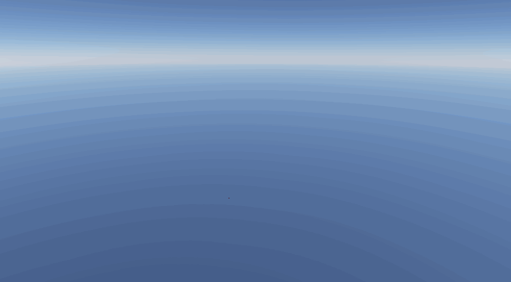
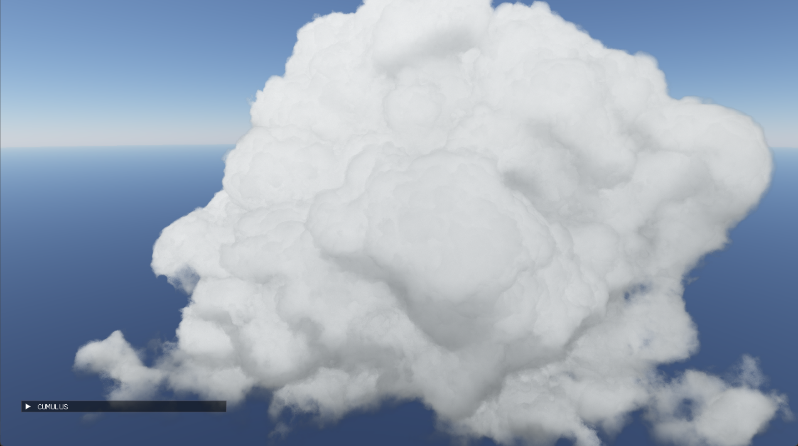
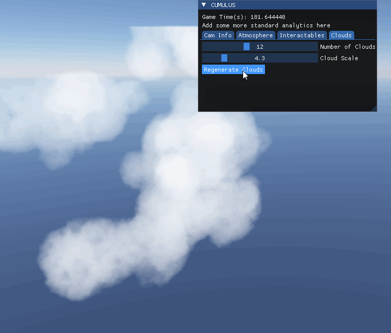
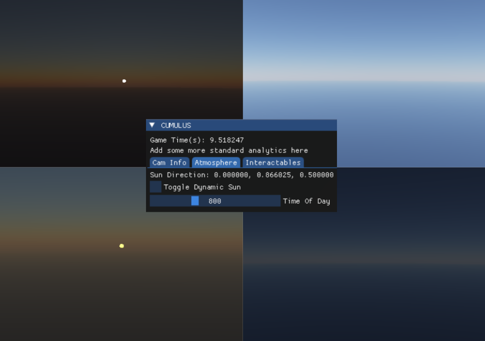

# Cumulus
A DirectX 12 project for real-time enabled cloud simulation and interactivity.

Made by [Ruben Young](https://www.rubenaryo.com/) [Jacky Park](https://jackypark.com/) [Eli Asimow](https://easimow.com/) and [Avi Serebrenik](https://aviserebrenik.wixsite.com/cvsite), Fall 2025

[Project Document](https://docs.google.com/document/d/1CNzmIo68LndPGS8ccK94FSIFHYH-5GL8HYOYqQdy90E/edit?usp=sharing)
[Milestone 1 Presentation](https://docs.google.com/presentation/d/1gGSEbZ7L8bbZHOn7OLQdZIwVBOCtymcEXTAHn48AE7w/edit?usp=sharing)
[Milestone 2 Presentation](https://docs.google.com/presentation/d/1K_11dz4fgYK21hM76VZPrON-3IzXVvsdjsIIQxzjrf8/edit?usp=sharing)

  
   
  <em>Camera flying in to a cloud</em>

## Overview
At its core, Cumulus is a realtime DirectX 12 cloud renderer with collisions, GPU generated clouds, and a clear environment.  

We utilize the cloud rendering framework from the Horizon game series, as outlined in the [Nubis 3](https://www.guerrilla-games.com/read/nubis-cubed) presentation from Advancements in Real-Time Rendering 2023. We then advance this method by incorporating interaction, allowing users to feel as though the clouds are truly part of the environment. Since the Nubis method uses offline modeled clouds, to enable interaction, we generate cloud data procedurally on the GPU to support our framework. This enables us to create more dynamic scenes, where we can smoothly transition between different weather conditions, resulting in true, realistic, and real-time cloudscapes.

## Current Features
### Clouds

  
   
  <em>A nice cloud in our engine</em>

#### Rendering
 - World-space NVDF placement — volumes positioned consistently in world coordinates
 - Ray-marched rendering — integrates density with Beer–Lambert absorption/compositing
 - SDF-guided stepping — signed-distance field cached in 3D textures to skip empty space
 - Noise-based Details — Additional details at 0.5m scale using Alligator and "Curly-Alligator" noise
#### Generation

  
   
  <em>Clouds created in real-time in a compute shader</em>

 - We support procedurally creating cloud NVDF data in a compute shader pass, which can be controlled in an ImGUI tab specifying cloud number and their average scale multiplier.
 - Creation starts by initializing cloud "seeds" on the CPU side, which become world-space coordinates where clouds get initialized. These positions can be updated to show cloud movement and formation.
 - For each seed, we create an SDF (given by [Inigo Quilez's blog](https://iquilezles.org/articles/distfunctions/)) that is a simple round cone with "Vesica Segments" aka football shapes around them. The number of these shapes, their size, and the orientation of all of these is given by noise, scaled by the input scale value.
 - Next, based on this SDF, we use a special "billow noise," which is a modified Perlin noise that gets its cells rotated to give a billowy look, as shown by the noise's authors [here](https://www.shadertoy.com/view/fdfcWs). Importantly, this noise gets the fractal sum treatment to ease out values for a less voxely look. It also gets eased out as we move away from the sdf boundaries for the same reason.
 - Finally, detail type and density scale get calculated, which give the clouds their upscaled features. Detail type comes from the same billowy noise at a different scale and gets more intense the farther up we go, to mimic how clouds are more whispy lower down, and density scale is quite uniform for us within the cloud's profile.

### Engine
#### Core
 - Atmosphere rendering pass
 - Compute Shader pipeline for ray-marching
 - Post-processing pipeline
 - Automated loading of models/textures from files
 - Construction of 3D NVDF data fields for the core Nubis method, 3D textures for atmosphere
#### Extra Features
 - String-based, shader-driven resource binding for easy user experience
    - Driven by ID3D12ShaderReflection
 - Rendering is abstracted into a “Pass” framework, 
    - Automatically generates Root Signatures and Pipeline States (shader-driven)
 - Upload Buffer system for staging CPU data temporarily before copying to the default heap
 - Automatic lifetime reporting for catching memory leaks in Debug mode
 - Diligent error detection and logging
 - ImGUI integration
### Wind

### Atmosphere

  
   
  <em>Sunrise, daytime, sunset, night time, with the ImGUI controls</em>

 - Based on [Eric Bruneton's Precomputed Atmospheric Scattering](https://ebruneton.github.io/precomputed_atmospheric_scattering/)
  - Skips precompute to read from offline Irradiance, Scattering, and Transmission textures
  - Blends Polar and Cartesian camera models
  - Day and night cycle with selectable time of day
  - Fully calculated in a pre-pass with raycasting
  - Added moon and night time sky.
  - Daytime can be modified in the UI to set sun position.

## Building
This project uses the Premake 5 build system, which is bundled with the application and the executable can be found under ./external/

To generate a Visual Studio solution, simply run generate_vs2022.bat on Windows. This will: 
- Generate a "Cumulus.sln" solution file
- Generate and configure the VS projects specified under ./premake5.lua
- Any Source/Header Files in the specified folder will be automatically added to the corresponding project. It is not necessary to modify the lua build script if adding a new file. 

## Details
This project is built using MSVC with the Visual Studio 2022 toolset (v143) for the C++17 standard.

## External Credits
 - [Nubis 3](https://www.guerrilla-games.com/read/nubis-cubed), the presentation behind this whole project
 - Stefan Gustavson and Ian MacEwan for making [billowy noise](https://github.com/stegu/psrdnoise/), and Stefan and Ashima Arts for [fast perlin noise](https://github.com/ashima/webgl-noise/tree/master) as well
 - Domenic Portera for the [HLSL port](https://github.com/domportera/hlsl-noise/tree/main) of the billowy noise.
 - [Eric Bruneton's Precomputed Atmospheric Scattering](https://ebruneton.github.io/precomputed_atmospheric_scattering/)
 - [Inigo Quilez's blog on SDFs](https://iquilezles.org/articles/distfunctions/)

## Dependencies
* [DirectX Tex](https://github.com/microsoft/DirectXTex/)
  * Reading image files for texture generation
* [Assimp 3.0.0](http://www.assimp.org/)
  * Loading 3D Models

## Bloopers

  
   
  <em>Broken Atmospheric Scattering</em>

  
   
  <em>Broken Camera Matrix while working on Atmospheric Scattering</em>

