

  <h1 align="center">Cumulus</h1>

  
  
  
  

   

  **A DirectX 12 implementation of real-time interactive volumetric cloud.**

   

  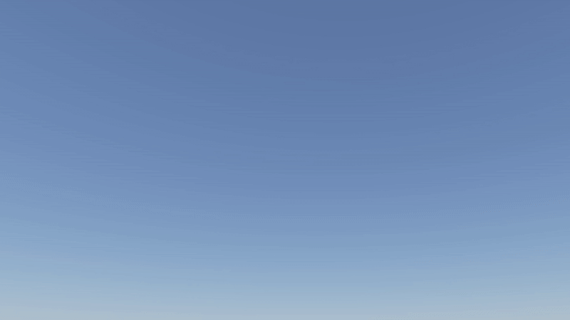
   

 

# Overview
**Cumulus** is a real-time, volumetric cloud rendering engine built from scratch in DirectX 12. 

It extends the architectural principles of Guerrilla Games' **[Nubis 3](https://www.guerrilla-games.com/read/nubis-cubed)** technology by introducing a fully procedural, **GPU-driven generation pipeline**. Unlike static implementations, Cumulus supports dynamic object interaction (collisions), time-of-day transitions, and variable density modeling without offline pre-computation.

# Table of Contents
- [Overview](#overview)
- [Features](#features)
  - [Volumetric Cloud Rendering](#volumetric-cloud-rendering)
  - [Procedural Cloud Generation](#procedural-cloud-generation)
  - [Physically-Based Atmosphere](#physically-based-atmosphere)
  - [DirectX 12 Engine](#muon-a-directx-12-engine)
- [Setup & Development](#setup--development)
  - [Building](#building)
  - [Technical Details](#technical-details)
  - [Dependencies](#dependencies)
- [Appendices](#appendices)
  - [External Credits](#external-credits)
  - [Related Presentations](#related-presentations)
  - [Bloopers](#bloopers)

# Features
## Volumetric Cloud Rendering

  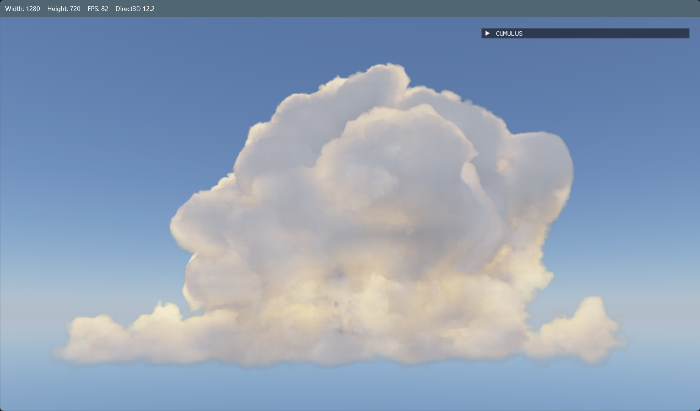
   
  <em> A Good Morning Type of Cloud</em>

### Voxel-Based Ray Marching & Data Structures
<table align="center">
  <tr>
    <td align="center">
      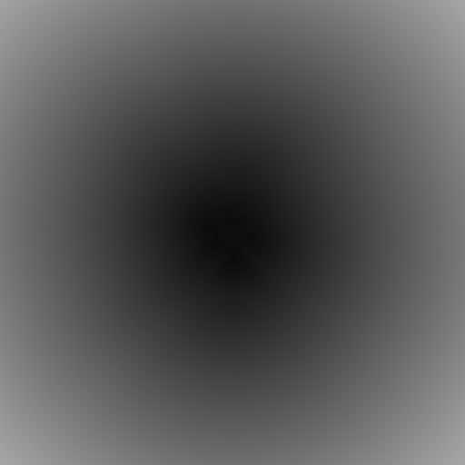
       
      <em>SDF Field</em>
    </td>
    <td align="center">
      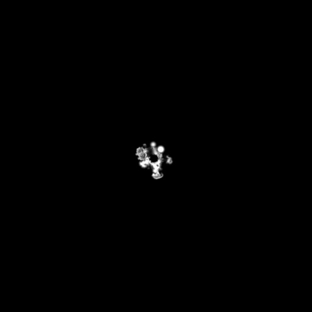
       
      <em>NVDF: Density</em>
    </td>
    <td align="center">
      
       
      <em>NVDF: Detail Type</em>
    </td>
    <td align="center">
      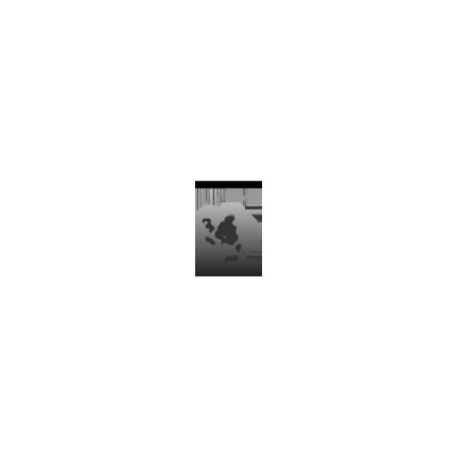
       
      <em>NVDF: Scale</em>
    </td>
  </tr>
</table>

Based on Guerrilla Games' **Nubis 3**, the renderer uses a dual-texture approach to decouple macro shapes from micro details while maximizing performance:

*   **NVDF (Noise-Voxel Density Field):** A 3D texture defining local material properties:
    *   **Density:** Base shape and opacity.
    *   **Detail Type:** Noise pattern selector (e.g., billow vs. wispy).
    *   **Scale:** Feature size control (e.g., fluffy tops vs. flat bottoms).
*   **SDF (Signed Distance Field):** A low-res distance map used for **empty-space skipping**. Rays take large steps through empty air and switch to fine integration only when the SDF indicates proximity to the cloud surface.

### Lighting Components 
<table align="center">
  <tr>
    <td align="center">
      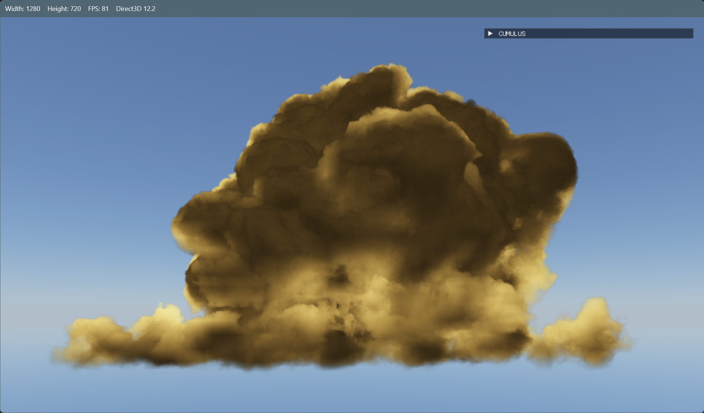
       
      <em>Direct Light</em>
    </td>
    <td align="center">
      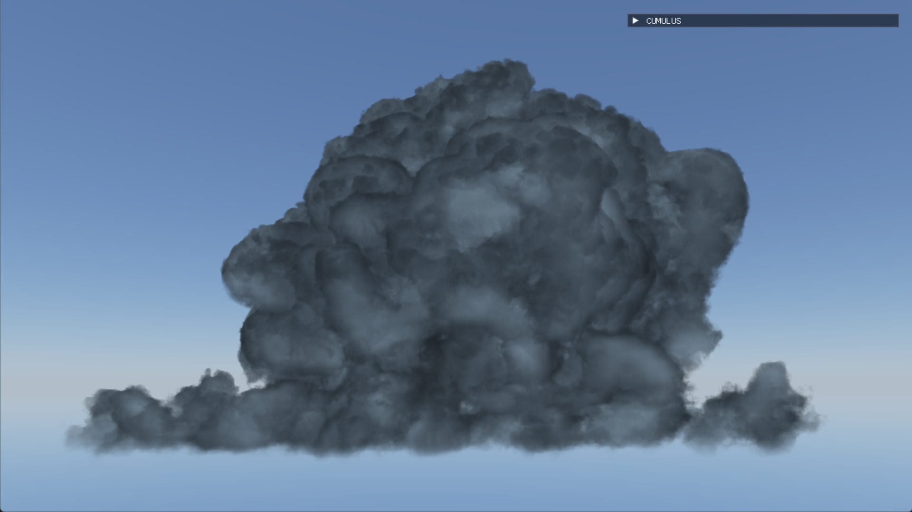
       
      <em>Multi-Scattering</em>
    </td>
  </tr>
  <tr>
    <td align="center">
      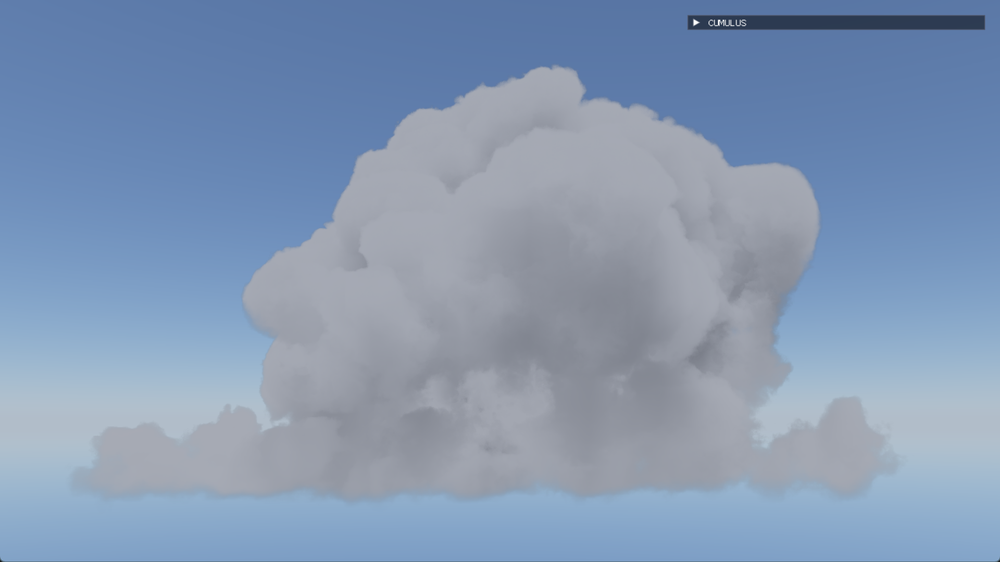
       
      <em>Ambient</em>
    </td>
    <td align="center">
      
       
      <em>Combined Beauty</em>
    </td>
  </tr>
</table>

The lighting model integrates three components based on the Nubis 3 architecture:
1.  **Direct Lighting:** Uses Beer’s Law for transmittance and a dual-lobe **Henyey-Greenstein** phase function to create intense forward scattering ("silver lining").
2.  **Multi-Scattering:** Approximates internal light diffusion and the "powder effect" (dark edges) using a probability function rather than expensive path tracing.
3.  **Ambient Lighting:** Applies a height-based gradient that blends sky color at the top with ground albedo at the bottom to ground the volume in the scene.

### Light Caching Optimization 

  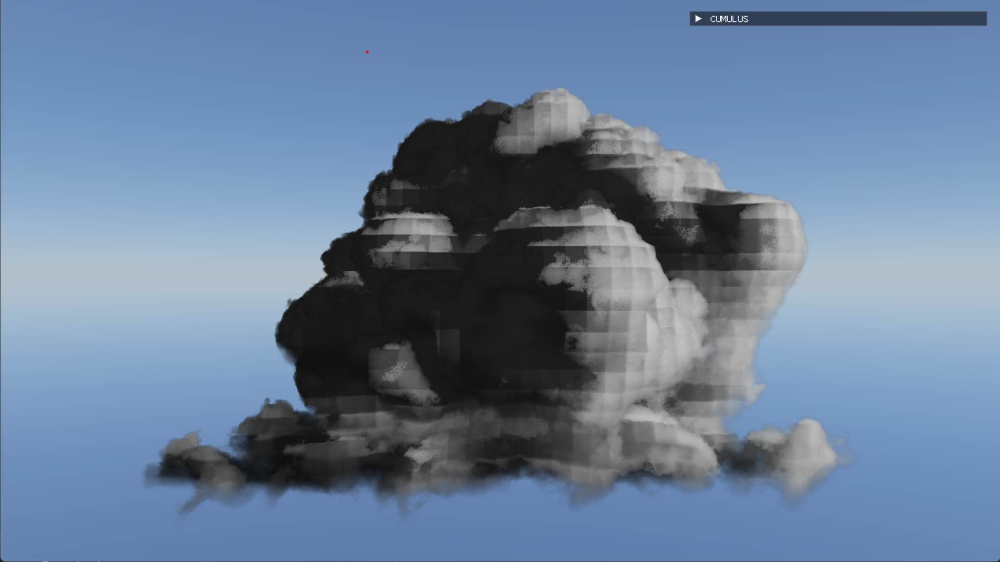
   
  <em>Visualizing the cached light volume</em>

 

To decouple the expensive lighting calculation from the view ray march, the engine implements **Light Ray Caching**. Lighting is pre-computed for each voxel in a separate compute pass before the main render. This prevents the nested loop nightmare of marching toward the sun at every view sample, allowing the primary ray to simply look up the incoming light energy cheaply.

## Procedural Cloud Generation

  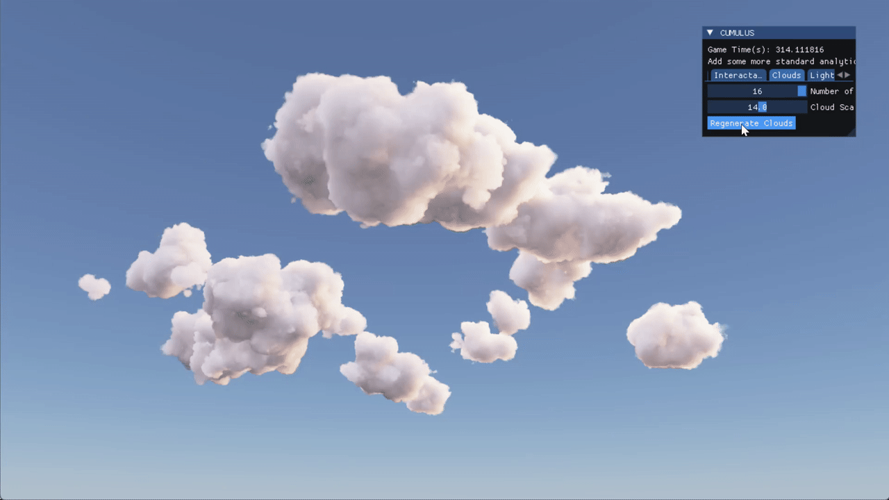
   
  <em>Clouds created in real-time in a compute shader</em>

### SDF-Based Random Cloud Generation

  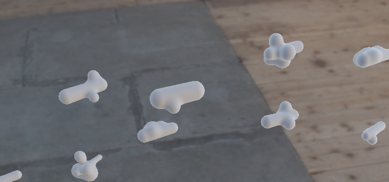
   
  <em>Visualization of the base SDF shapes</em>

 

Cloud formation is fully procedural and controllable in real-time via ImGUI (e.g., cloud count, scale multiplier). The generation pipeline operates in two stages:
1.  **CPU Seeding:** "Seeds" are initialized as world-space coordinates to track cloud position, movement, and formation over time.
2.  **GPU Shaping:** For each seed, a compute shader generates a base SDF shape using **Inigo Quilez’s** [primitive distance functions](https://iquilezles.org/articles/distfunctions/). The base form is a round cone surrounded by "Vesica Segments" (football-like shapes), where orientation, count, and size are driven by noise and the input scale factor.

## Real-Time Volumetric Interactions

  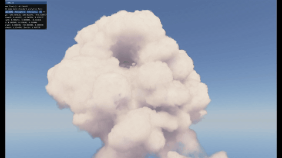
   
  <em>Real-time object collision</em>

### Script-Directed Cloud Instantiation

  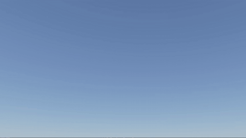
   
  <em>Jet-trails!</em>

Cloud placement is procedurally driven by an "SDF Path" system. An event system instantiates clouds along guided paths defined by Signed Distance Fields. Each cloud instance maintains unique parameters for **density decay** and **detail type**, allowing for art-directable variations within a procedurally generated sky.

### Novel Cloud Destruction

  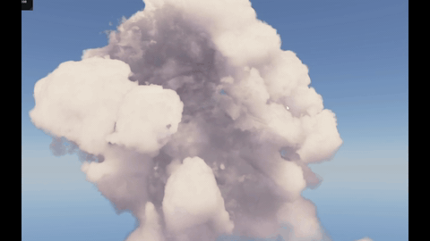
   
  <em>Convex-hull Visualization</em>

The engine supports real-time volumetric destruction. Interaction is handled by checking **convex hull collisions** against the cloud's density voxels. Those  checks are accelerated via a compute shader. Collision data is packed per mesh instance, rather than entity instance, to minimize memory overhead during the physics pass.

### Noise Baking Optimization
<table align="center" width="80%">
  <tr>
    <td align="center">
      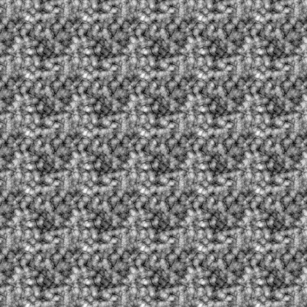
       
      <em>Baked Noise: Dimensional Profile</em>
    </td>
    <td align="center">
      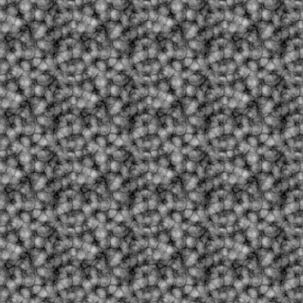
       
      <em>Baked Noise: Detail Type</em>
    </td>
  </tr>
</table>

To ensure runtime performance, complex noise functions are **pre-baked** into static 3D textures rather than calculated per-frame:
-   **Billow Noise:** Based on the **[psrdnoise](https://github.com/stegu/psrdnoise/)** implementation by Stefan Gustavson and Ian MacEwan, this modified Perlin noise uses rotated cells to create the characteristic "puffiness" of cumulus clouds.
-   **Fractal Sum & Easing:** Noise values are eased out near SDF boundaries and accumulated using fractal sums to eliminate voxel-like artifacts.
-   **Detail & Density:** High-frequency detail is driven by scaled billow noise that intensifies with altitude (mimicking wispy cloud tops), while density scale remains relatively uniform across the profile.

## Physically-Based Atmosphere

  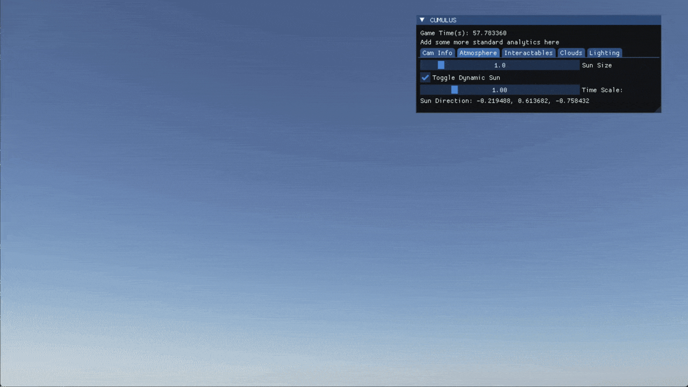
   
  <em>Sunrise, daytime, sunset, night time, with the ImGUI controls</em>

The atmospheric rendering system implements Eric Bruneton's **[Precomputed Atmospheric Scattering](https://ebruneton.github.io/precomputed_atmospheric_scattering/)** model. To maximize performance, the engine bypasses runtime initialization by loading pre-baked Irradiance, Scattering, and Transmission textures. 

The sky is rendered in a raycasting pre-pass that seamlessly blends Polar and Cartesian camera models to support a fully dynamic day/night cycle, complete with UI-controllable sun positioning and a custom moon and night sky implementation.

## Muon: A DirectX 12 Engine
<table align="center">
  <tr>
    <td align="center">
      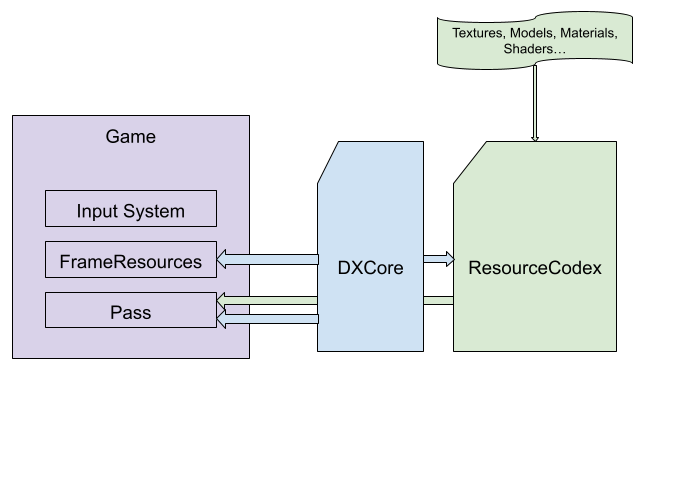
       
      <em>Engine overview diagram</em>
    </td>
    <td align="center">
      
       
      <em>Full render pipeline</em>
    </td>
  </tr>
</table>

### Rendering Pipeline
-   **Volumetric Ray-Marching:** Compute-driven pipeline for handling density integration, light caching, and SDF stepping.
-   **Atmospheric Scattering:** Dedicated pre-pass for sky, sun, and moon rendering based on precomputed LUTs.
-   **Simulation & Physics:** Compute shaders for procedural cloud generation and convex hull collision detection.
-   **Post-Processing:** Full-screen pass system for tone mapping and final compositing.
-   **Asset Management:** Automated loading of 3D models (Assimp) and texture construction (DirectXTex) for NVDF, SDF, and Noise volumes.

### Architecture & Tooling
-   **Shader-Driven Reflection:** Resource binding is automated via `ID3D12ShaderReflection`, allowing for string-based parameter setting without manual root signature matching.
-   **"Pass" Framework:** A high-level abstraction that automatically generates Root Signatures and Pipeline State Objects (PSOs) based on shader requirements.
-   **D3D12 Abstractions:** User-friendly wrappers for complex DirectX 12 objects including `Texture`, `UploadBuffer` (staging), and `FrameResource` management.
-   **Diagnostics:** Integrated ImGUI for runtime controls, plus automatic lifetime reporting and strict error logging to catch memory leaks in Debug mode.

<!-- 
Add this back later once more complete  

### Wind

 -->

# Setup & Development 
## Building
This project uses the **Premake 5** build system (bundled in `./external/`) to automate project configuration.

To build the project:
1.  Run `generate_vs2022.bat` on Windows.
2.  Open the generated `Cumulus.sln` in Visual Studio 2022.
3.  Build and run.

*Note: The Premake script (`premake5.lua`) automatically detects and adds new source/header files in the source directories, so manual project updates are not required when adding files.*

## Requirements
*   **OS:** Windows 10/11
*   **IDE:** Visual Studio 2022 (MSVC v143 toolset)
*   **Language:** C++17
*   **GPU:** DirectX 12 compatible hardware

## Dependencies
* [DirectX Tex](https://github.com/microsoft/DirectXTex/): Reading image files for texture generation
* [Assimp 3.0.0](http://www.assimp.org/): Loading 3D Models

# Appendices
## External Credits
 - [Nubis 3](https://www.guerrilla-games.com/read/nubis-cubed), the presentation behind this whole project
 - Stefan Gustavson and Ian MacEwan for making [billowy noise](https://github.com/stegu/psrdnoise/), and Stefan and Ashima Arts for [fast perlin noise](https://github.com/ashima/webgl-noise/tree/master) as well
 - Domenic Portera for the [HLSL port](https://github.com/domportera/hlsl-noise/tree/main) of the billowy noise.
 - [Eric Bruneton's Precomputed Atmospheric Scattering](https://ebruneton.github.io/precomputed_atmospheric_scattering/)
 - [Inigo Quilez's blog on SDFs](https://iquilezles.org/articles/distfunctions/)
 - [Björn Ottosson's okLab Conversion](https://bottosson.github.io/posts/oklab/)

## Related Presentations 
- [Milestone 1 Presentation](https://docs.google.com/presentation/d/1gGSEbZ7L8bbZHOn7OLQdZIwVBOCtymcEXTAHn48AE7w/edit?usp=sharing)
- [Milestone 2 Presentation](https://docs.google.com/presentation/d/1K_11dz4fgYK21hM76VZPrON-3IzXVvsdjsIIQxzjrf8/edit?usp=sharing)
- [Milestone 3 Presentation](https://docs.google.com/presentation/d/1Wxr8XVlCBgfmKN3kdevFCKOIQIkZpVcvfKtLUC52uyo/edit?usp=sharing)

## Bloopers

  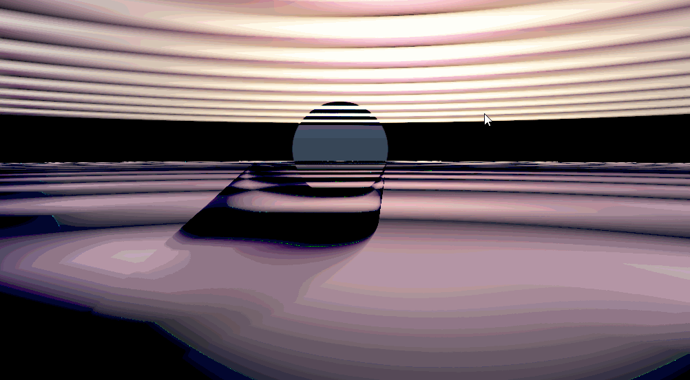
   
  <em>Broken Atmospheric Scattering</em>

  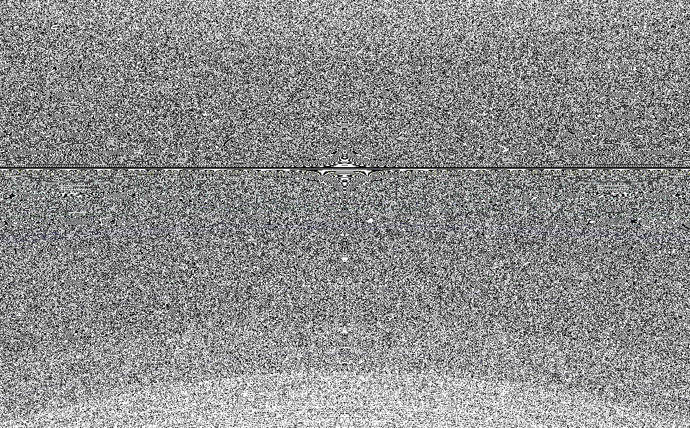
   
  <em>Broken Camera Matrix while working on Atmospheric Scattering</em>

